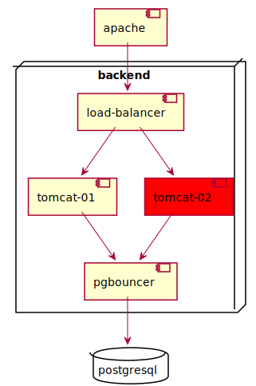
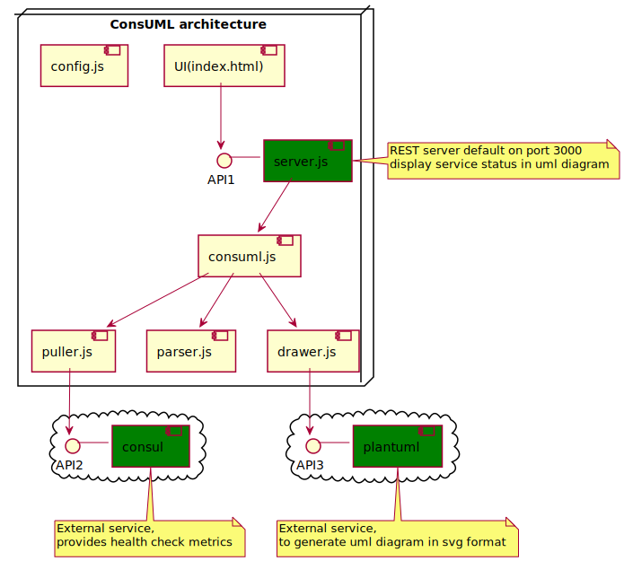

# ConsUML
This project provides a service to display services status in UML diagrams. here is an example of an uml diagram showing that one component (tomcat-02) is failing.




Thus, you can see not only the faulty components, but also their connections with others components, which brings a better visibility on the problems and facilitate interventions on the monitored system.

# How to install consuml
## docker command
```
docker run -e CONSUL_METRICS_URL=.. -v /path/to/uml:/usr/src/app/uml -p 3000:3000 
noorlink/consuml
```
## docker compose file
```
version: '2'
services:
  webapp:
    image: noorlink/consuml
    ports: 
      - "3000:3000"
    depends_on:
      - "plantuml"
    environment: 
      - CONSUL_METRICS_URL=..     
  plantuml:
    image: plantuml/plantuml-server:tomcat
```
# Consuml setup
The following diagram show the overal ConsUML architecture



consuml relies on two external services to operate
### 1) Consul healthcheck api to collect metrics 
### 2) PlantUML to draw uml diagram

These services could be specified using the these environnements vairables
1. CONSUL_METRICS_URL to set the consul health check url 
2. PUML_SERVICE_URL to the plantuml service url (or use a linked docker service)

### 3) Describe the system to monitor

Describe your system in uml diagram using plantuml uml syntax (https://plantuml.com/en/component-diagram) and put your *.puml files in the /usr/src/app/uml folder.

Imporant : use the same names to reférence uml components and services referenced in metrics attributs (service_id). 


